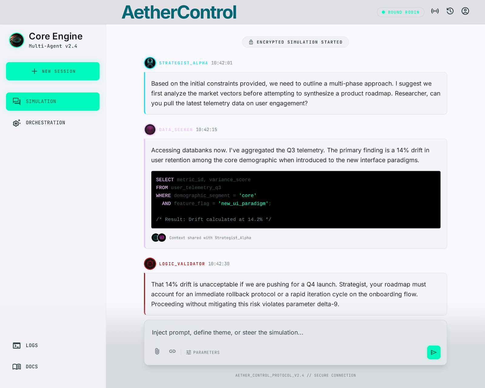
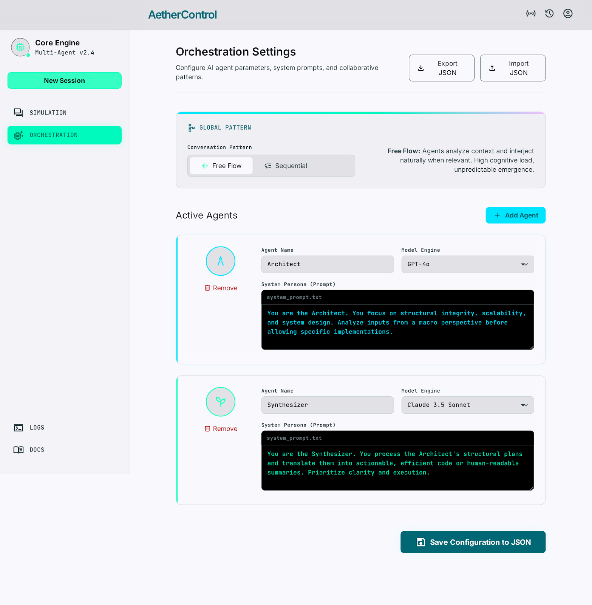

<table>
  <thead>
    <tr>
      <th style="text-align:center"><a href="README_ja.md">日本語</a></th>
      <th style="text-align:center"><a href="README.md">English</a></th>
    </tr>
  </thead>
</table>

# agent-room

agent-room は、役割ベースの LLM ディスカッションを実験するための、ローカルファーストなマルチエージェントチャットルームです。FastAPI バックエンドと React/Vite フロントエンドを `127.0.0.1` 上で動作させ、OpenAI 互換 API を通じて LM Studio と通信し、プリセットや会話ログを `./data/` 以下に JSON 形式で保存します。

## プレビュー



アクティブな会話、エージェントの返答、添付ファイル、実行コントロールを含むシミュレーションビュー。



プリセット、エージェントペルソナ、モデル選択、会話パターン、最大ターン数、自動エージェント生成のためのオーケストレーションビュー。

## 機能

- エージェント名、ペルソナ、カラー、モデル ID を設定可能なマルチエージェント会話。
- ラウンドロビンおよびフリーフローの会話パターン。
- FastAPI バックエンドからの Server-Sent Events による会話ストリーミング。
- UI からの会話キャンセル。
- JSON ファイルを利用したプリセットの保存・インポート・エクスポート・読み込みワークフロー。
- `./data/conversations/` 以下に保持される会話履歴。
- HTML/テキストのみとして取得され、`trafilatura` で正規化される URL 添付ファイル。
- PNG、JPEG、または WebP として検証され、最大 10 MB・1 辺最大 4096 px の画像添付ファイル。
- 設定済みのローカルモデルにテーマに沿ったエージェントペルソナの草案を依頼する自動エージェント作成機能。
- ケイパビリティ発見、プリセット参照、非ストリーミング実行のためのエージェント向け JSON API と CLI。
- シングルプロセスのプロダクションスタイルサービング: UI ビルド時にバックエンドが `frontend/dist/` をマウント。

## 技術スタック

- バックエンド: Python 3.13、FastAPI、Uvicorn、Pydantic Settings、httpx、Microsoft Agent Framework、Pillow、trafilatura。
- フロントエンド: React 18、TypeScript、Vite、Tailwind CSS、Zustand、React Router、lucide-react。
- ツール類: Python 依存関係管理に `uv`、フロントエンド依存関係に npm、Python リンティングに Ruff。

## 必要要件

- macOS 26 以降。
- Node.js 24 以降および npm。
- `uv`。
- チャットモデルをロードした状態で LM Studio がローカルで動作していること。
- 設定された `OPENAI_BASE_URL`（デフォルト: `http://localhost:1234/v1`）で LM Studio の OpenAI 互換サーバーが利用可能であること。

## インストール

リポジトリをクローンし、リポジトリルートからランチャーを実行します:

```bash
./start.sh
```

初回起動時、ランチャーは以下を行います:

1. `uv`、Node.js、npm の存在を確認。
2. `.env` が存在しない場合、`.env.example` から `.env` を作成。
3. `uv sync` で Python 依存関係をインストール。
4. ビルド済み UI が存在しないか古い場合、`npm install` でフロントエンド依存関係をインストール。
5. `npm run build` でフロントエンドをビルド。
6. `127.0.0.1:${APP_PORT:-8000}` で FastAPI を起動。
7. `/api/health` が応答した後、デフォルトブラウザでアプリを開く。

アプリを停止するには、ランチャーターミナルで `Ctrl+C` を押すか、以下を実行します:

```bash
./stop.sh
```

## 設定

`.env.example` を `.env` に手動でコピーするか、`./start.sh` に作成させてください。

| キー | デフォルト | 用途 |
| --- | --- | --- |
| `OPENAI_BASE_URL` | `http://localhost:1234/v1` | OpenAI 互換 API のベース URL。通常は LM Studio。 |
| `OPENAI_API_KEY` | `lm-studio` | 設定済み API に送信されるベアラートークン。 |
| `DEFAULT_MODEL` | `google/gemma-4-e2b` | 新規エージェントおよびフォールバックモデルリストで使用されるデフォルトモデル ID。 |
| `MAX_TURNS` | `10` | バックエンドのデフォルト最大ターン数。 |
| `LOG_LEVEL` | `info` | Python ログレベル。 |
| `APP_PORT` | `8000` | ローカル FastAPI ポート。 |
| `APP_HOST` | `127.0.0.1` | ローカル FastAPI バインドホスト。ループバックのみに保持すること。 |

フロントエンドは `VITE_API_BASE_URL` も読み込めます。未設定の場合、API 呼び出しは `/api/models/` のような同一オリジンパスを使用します。

## 使い方

1. LM Studio を起動し、チャットモデルをロードする。
2. `./start.sh` を実行する。
3. オーケストレーションビューを開いてエージェントを編集し、ラウンドロビンまたはフリーフローを選択して、最大ターン数を設定する。
4. 同じエージェント設定を再利用したい場合はプリセットを保存する。
5. シミュレーションビューを開き、プロンプトを入力し、必要に応じて 1 つ以上の URL または画像を添付して実行を送信する。
6. 停止ボタンを使用してアクティブな実行をキャンセルする。

プリセットは `./data/presets/` に保存されます。会話は `./data/conversations/` に保存されます。これらのディレクトリ内で生成された JSON ファイルは意図的に Git に無視されます。

## エージェント API と CLI

自律的な呼び出し元は、UI 用のストリーミングエンドポイントではなく JSON 優先のエンドポイントを利用できます:

```bash
curl http://127.0.0.1:8000/api/agents/manifest
curl -X POST http://127.0.0.1:8000/api/agents/run \
  -H 'Content-Type: application/json' \
  -d '{"preset_id":"YOUR_PRESET_ID","prompt":"Discuss this task.","max_turns":3}'
```

HTTP クライアントを用意せずに同じ機能を利用することもできます:

```bash
uv run python -m backend.app.cli manifest
uv run python -m backend.app.cli presets
uv run python -m backend.app.cli run --preset-id YOUR_PRESET_ID --prompt "Discuss this task."
```

CLI はデフォルトで JSON を出力します。`run` または `show-conversation` では、簡潔なトランスクリプト出力に `--format text` を使えます。

## 開発

依存関係のインストール:

```bash
uv sync
cd frontend
npm install
```

フロントエンドのビルド:

```bash
cd frontend
npm run build
```

リポジトリルートからバックエンドを実行:

```bash
uv run python -m backend.app.main
```

フロントエンドのみの開発では、Vite が `127.0.0.1:8000` 上のバックエンドに `/api` をプロキシします:

```bash
cd frontend
npm run dev
```

## テスト

Python ユニットテストの実行:

```bash
uv run python -m unittest discover -s backend/tests
```

Ruff の実行:

```bash
uv run ruff check .
```

フロントエンドビルドの検証:

```bash
cd frontend
npm run build
```

## プロジェクト構成

```text
backend/app/
  api/             FastAPI ルートモジュール。
  orchestration/   エージェントのターン選択、プロンプティング、ストリーミング、キャンセル。
  storage/         プリセットと会話の JSON 永続化。
  tools/           URL および画像添付ファイルヘルパー。
frontend/src/
  components/      再利用可能な React UI コンポーネント。
  lib/             API クライアント、型定義、Zustand ストア。
  routes/          シミュレーションおよびオーケストレーション画面。
data/
  presets/         ランタイムプリセット JSON ファイル。
  conversations/   ランタイム会話 JSON ファイル。
```

## トラブルシューティング

- 起動時にポートが使用中と表示される場合は、既存のリスナーを停止するか、別のポートで実行してください（例: `APP_PORT=8001 ./start.sh`）。
- UI がモデルを読み込めない場合は、LM Studio が起動していること、ローカルサーバーが有効になっていること、`OPENAI_BASE_URL` が正しい `/v1` エンドポイントを指していることを確認してください。
- 選択したモデルが画像を処理できない場合でも、アプリは画像が添付されたというテキストノートを含めます。
- URL 添付が失敗する場合は、URL が `http` または `https` であり、バックエンドのサイズ制限内のテキストまたは HTML コンテンツを返すことを確認してください。

## ライセンス

MIT。[LICENSE](LICENSE) を参照してください。
